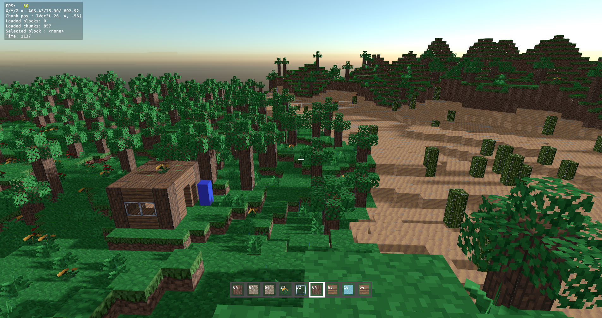
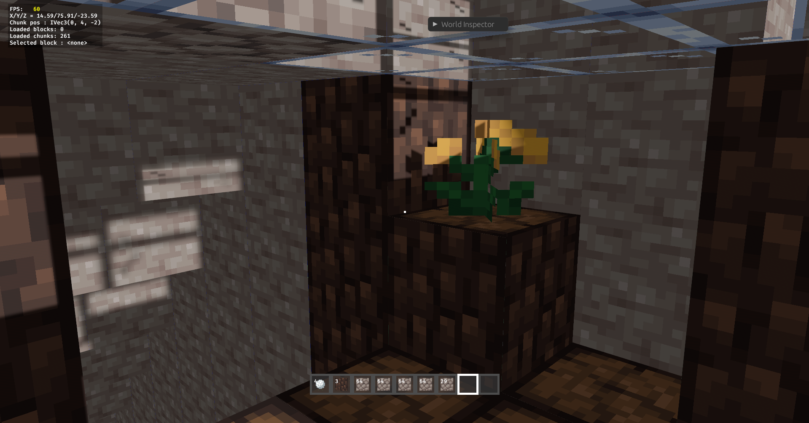

# rustcraft

Minecraft game clone written in Rust, using the Bevy game engine.

<br>





<br>

# Table of contents

- [Features](#features)
- [Download](#download)
- [Controls](#controls)
- [How to Build](#how-to-build)
    - [Prerequisites](#prerequisites)
    - [Running the Project](#running-the-project)
- [Contributing](#contributing)
    - [Guidelines](#guidelines)

<br>

# Features
- Procedurally generated worlds with biomes (Plains, Forest, Mountains, Desert, Ice Plain, Flower plains), trees, cactus, tall grass and flowers.
- Multiplayer functionality.
- Day/night cycle
- Block breaking and placing mehanics.
- Inventory system with a functional hotbar.
- World saving and loading.
- Customizable keybindings and dynamic render distance adjustment.

<br>

# Download

You can download the game for **Windows** and **Linux** from the [Releases page](https://github.com/c2i-junia/rustcraft/releases) of the GitHub repository.

Once downloaded, extract the archive for your operating system. The executable will be located in the `/bin` folder of the extracted directory.

<br>

# Controls

| **Category**     | **Action**             | **Key(s)**                  |
|-------------------|------------------------|-----------------------------|
| **Movement**      | Jump                  | Space                       |
|                   | Strafe Left           | A / Arrow Left              |
|                   | Strafe Right          | D / Arrow Right             |
|                   | Walk Backward         | S / Arrow Down              |
|                   | Walk Forward          | W / Arrow Up                |
|                   | Toggle Fly Mode       | F                           |
|                   | Fly Up                | Space                       |
|                   | Fly Down              | Left Shift                  |
|                   |                        |                             |
| **Gameplay**      | Destroy Block         | Left Mouse Button           |
|                   | Place Block           | Right Mouse Button          |
|                   |                        |                             |
| **Inventory**     | Open/Close Inventory  | E                           |
|                   | Pick up stack         | Left Click                  |
|                   | Pick up half of stack | Right Click (with empty mouse) |
|                   | Deposit 1 item        | Right Click (over valid stack) |
|                   | Deposit MAX items     | Left Click (over valid stack) |
|                   | Exchange stacks       | Left Click (over a different stack or full valid stack) |
|                   |                        |                             |
| **Miscellaneous** | Toggle FPS Display    | F3                          |
|                   | Toggle Perspective    | F5                          |
|                   | Toggle Chunk Debug    | F4                          |
|                   | Toggle Block Debug    | F6                          |
|                   | Decrease Render Distance | O                        |
|                   | Increase Render Distance | P                        |
|                   | Exit Game             | Escape                      |

<br>

# How to Build

## Prerequisites

To build and run this project, you need the following tools and dependencies installed:

### 1. **Rust**
- Install Rust using [Rustup](https://rustup.rs)
- After installation, add the **Nightly toolchain** with the Cranelift backend:
  ```bash
  rustup install nightly
  rustup default nightly
  rustup component add rustc-codegen-cranelift-preview --toolchain nightly
  ```

### 2. **Just**
- **Just** is used in this project to manage build. Install it using Cargo:
  ```bash
  cargo install just
  ```
> Note: You can also install Just using your system's package manager.

### 3. **Dependencies**

Install the required dependencies based on your operating system:

#### Windows
- **Git Bash** is required to ensure the commands in the `Justfile` and scripts run correctly. Download and install [Git Bash](https://git-scm.com/).
- After installation, make sure Git Bash is added to your system's `PATH`. You can verify it by running:
  ```bash
  bash --version
  ```

#### Arch Linux
```bash
sudo pacman -S base-devel mold clang vulkan-radeon vulkan-tools
```
- Replace `vulkan-radeon` with:   
  - `vulkan-intel` for Intel GPUs.   
  - `nvidia-utils` for NVIDIA GPUs.   

#### Ubuntu/Debian
```bash
sudo apt update && sudo apt install -y \
    build-essential mold clang mesa-vulkan-drivers vulkan-tools
```
- For NVIDIA GPUs, also install:
    ```shell
    sudo apt install -y nvidia-driver nvidia-vulkan-icd
    ```

## Running the Project

To compile and run the game locally, use the following commands:

> Note: the first compilation will be slow depending on your hardware, next compilations will be incremental and thus faster.

```sh
# Clone the repository
git clone https://github.com/c2i-junia/rustcraft

# Navigate to the project directory
cd rustcraft
```

Debug mode:
```sh
./run1.sh        # this will compile the project and run the client 

./run-server.sh  # (optional) do this only to test multiplayer features
```

Release mode:
```sh
# Build the project in release mode
just generate-release-folder

# Run the executable
./release/bin/rustcraft         # run the client

./release/bin/rustcraft-server  # (optional) do this only to test multiplayer features
```

<br>

# Contributing

Feel free to submit issues or open pull requests. If you want to know where to help, refer to the existing issues.

## Guidelines 

### Format
Run `cargo fmt` before committing.

### Commit messages:

- We follow the [Conventional Commit specification](https://www.conventionalcommits.org/en/v1.0.0/). Our commit types are inspired by the [Karma specification](http://karma-runner.github.io/6.4/dev/git-commit-msg.html)
  ```
  <type>[optional scope]: <description>

  [optional body]

  [optional footer(s)]
  ```

  Allowed <type> values: 
  - **feat** for a new feature for the user, not a new feature for build script. Such commit will trigger a release bumping a MINOR version.
  - **fix** for a bug fix for the user, not a fix to a build script. Such commit will trigger a release bumping a PATCH version.
  - **perf** for performance improvements. Such commit will trigger a release bumping a PATCH version.
  - **docs** for changes to the documentation.
  - **style** for formatting changes, missing semicolons, etc.
  - **refactor** for refactoring production code, e.g. renaming a variable.
  - **test** for adding missing tests, refactoring tests; no production code change.
  - **build** for updating build configuration, development tools or other changes irrelevant to the user.

- Write commit messages in the present tense (e.g., "Add feature X" instead of "Added feature X").

### Branches
- Use the naming convention `<type>/<name>` for branches introducing new features. Only use lowercase letters, numbers, and dashes.
- The `main` branch should always compile successfully and be free of warnings. Use `cargo check`.
- Experimental branches are allowed to include code that does not build successfully.
- Prefer rebasing over merging.
